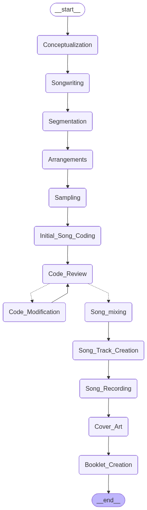

# Code2Chord

MusicAgent 是一个基于 LangGraph 的自动作曲 Agent。它会根据用户输入的歌曲名称、时长、风格和描述，依次完成概念设计、歌词创作、编曲、Sonic Pi 代码生成、代码审查、混音、人类反馈、封面生成和作品说明生成。

项目当前以命令行入口 `run.py` 为主，最终输出会保存到 `Songs/<歌曲名>/` 目录中，包括 Sonic Pi 脚本、运行日志、封面图片和歌曲说明。

## 主要能力

- 多 Agent 创作流程：Composer、Songwriter、Arranger、Sonic PI coder、Sonic PI reviewer、Sonic PI Mix Engineer、Human Review。
- LangGraph 编排：用有状态图把创作步骤串联起来，并通过 SQLite checkpoint 支持同名歌曲续跑。
- Sonic Pi 本地验证：生成的 `.rb` 代码会发送到本机 Sonic Pi runtime 执行，并通过 OSC feedback 判断是否有错误。
- 提示词可配置：节点提示词在 `prompts/node_prompts.json`，系统角色提示词在 `prompts/system_prompts.json`。
- 采样素材检索能力：`Samples/` 下维护了音频素材、metadata 和 FAISS 索引，代码里保留了基于 sentence-transformers 的素材检索流程。
- 封面生成与作品 booklet：流程末尾会生成封面，并在歌曲目录里写入 README。

## 项目结构

```text
.
├── run.py                              # 命令行启动入口
├── App/
│   ├── config.py                       # 配置加载：API key、Sonic Pi 地址、端口、可执行文件路径
│   ├── services/
│   │   ├── graph.py                    # MusicGraph 主流程
│   │   ├── sonicPi.py                  # Sonic Pi 启动、连接、执行和反馈
│   │   ├── SampleMedataListing.py      # 音频素材分析与 FAISS 索引生成
│   │   └── audiorecorder.py            # Sonic Pi 播放录音辅助
│   ├── static/config/
│   │   ├── settings.json               # 本地运行配置
│   │   └── model_config.json           # 模型配置说明
│   └── tests/                          # Sonic Pi 和单节点图测试脚本
├── prompts/
│   ├── node_prompts.json               # 每个图节点的用户提示词模板
│   └── system_prompts.json             # 每个 Agent 的系统提示词
├── Samples/                            # 音频素材与索引
├── Songs/                              # 生成结果输出目录
├── graph.png                           # LangGraph 流程图导出
└── music_graph_checkpoints.sqlite      # LangGraph checkpoint 数据库
```

## 创作流程

`MusicGraph.build_graph()` 中定义的主流程如下：



```text
Conceptualization
  -> Songwriting
  -> Segmentation
  -> Arrangements
  -> Initial_Song_Coding
  -> Code_Review
  -> Code_First_Modification（必要时循环一次）
  -> Song_Mixing
  -> Code_Second_Modification（人类反馈）
  -> Cover_Art
  -> Booklet_Creation
```

每个节点要求模型返回严格 JSON。Sonic Pi 代码会写入 `Songs/<歌曲名>/<歌曲名>.rb`。如果已有同名脚本且内容不同，旧版本会自动重命名为 `<歌曲名>_1.rb`、`<歌曲名>_2.rb` 等。
